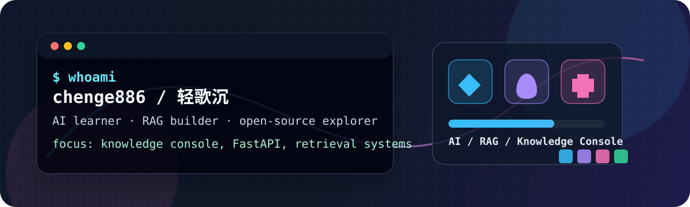

# Hi ~ I'm 轻歌沉

  

  
  
  
  
  
  
  
  
  
  
  
  
  

## ABOUT ME

- **惠州学院**学生，坐标 **China Huizhou**。
- 关注 **AI 应用工程**、**RAG 知识检索**、**知识库系统** 和 **Web 工具开发**。
- 正在通过项目实践、阅读开源代码和打磨开发流程来持续学习。
- 欢迎交流 Python 后端、检索系统、智能体工作流和产品化工程实践。

<table>
  <tr>
    <td>
      <strong>联系方式</strong> 
       
      也可以通过 GitHub 主页或仓库 Issue 与我交流。
    </td>
  </tr>
</table>

## 贡献动画

  

---

  持续学习，持续构建，持续交付。

